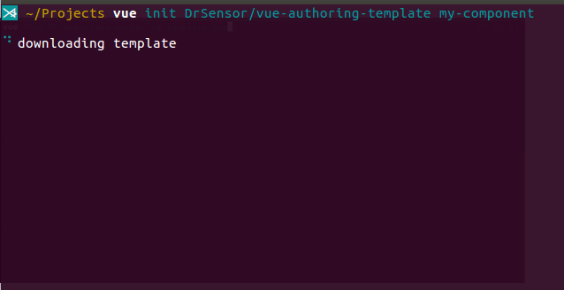

# vue-authoring-template
<!-- [](https://circleci.com/gh/DrSensor/vue-authoring-template) -->


[](https://github.com/DrSensor/vue-authoring-template/blob/master/DONATE.md)

This template is to help authoring Vue component with it's use case in story-scenario (storybook) format.



## Motivation
1. There is a time when developer involved in a project then build component to solve specific problem 😎.
2. One day this developer happen to do the same thing again in different project with slight alteration 😏.
3. Then doing it again, and again, and again 😫.
4. Now this developer have build many component with the same topic 😂.
5. So, why not publish it as a single component with that one topic in mind to [`npm`](https://www.npmjs.com/)? 😲
6. However, the component must be showcased in [mvce](https://stackoverflow.com/help/mcve) style to make it easy to understand and maintainable 😖.
7. As the time passed, he/she is to lazy to do that because no template/config/cli/whatever for authoring the component in that way :poop:.

## Usage
```bash
vue init DrSensor/vue-authoring-template
```
After that,

- to build vue component use
```
[npm|yarn] build:component
```
- to build the storybook use
```
[npm|yarn] build:storybook
```
- to start it in development mode use
```
[npm|yarn] dev
```

## Project Structure
```markdown
.
├── package.json            // choose and configure the component you want to package in here (still need to edit `scripts: {}` block)
├── .editorconfig
├── .gitignore
│
├── .circleci
│   └── config.yml
├── .loader                 // loader for processing custom blocks
│   ├── docs-loader.js
│   ├── info-loader.js
│   └── notes-loader.js
├── .storybook
│   ├── addons.js
│   ├── config.js
│   └── poi.config.js       // currently the template project use `poi` as alternative of `vue build`
│
├── components              // place 1 or more components to author here
│   └── HelloWorld.vue
│
└── stories                 // use case or usage of the component written in story-scenario analogy
    ├── Story1
    │   └── Scenario1.vue
    ├── Story2
    ├── Story3
    ├── config.js           // config to order the story and the scenario
    └── index.js            // chain and add the addon here
```

## Features
- Support `vue init` workflow
- Minimal configuration. Thanks to [poi](https://poi.js.org).
- Prebuilt [circleci](https:circleci.com) config to build, deploy, and evaluate pull-requests. By default its deployed to [surge.sh](https://surge.sh).
- Order the story-scenario *alphabetically* or define it using `Array`|`Object` in `stories/config.js`.
- Preinstall and configured storybook addon:
    - knobs
    - readme, info(experimental), and notes
    - actions
- Custom blocks (experimental, looking for feedback).

## Looking for suggestion (Open New Issues)
- Make chaining storybook-addon on each scenario in elegant way
- How to customize style of the storybook
- Authoring `Vuex` module? (is it necessary?)
- any others?

## Support
See [CONTRIBUTING.md](https://github.com/DrSensor/vue-authoring-template/blob/master/CONTRIBUTING.md) for contributing directly via:
- [Pull Requests](https://github.com/DrSensor/vue-authoring-template/blob/master/CONTRIBUTING.md/#pull-requests) or
- [Create Issues](https://github.com/DrSensor/vue-authoring-template/blob/master/CONTRIBUTING.md/#create-issues)

## License
[MIT](https://github.com/DrSensor/vue-authoring-template/blob/master/LICENSE) License
